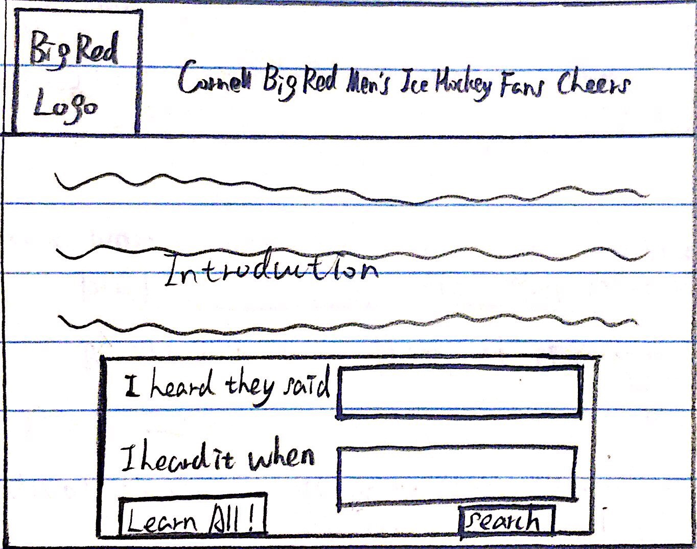
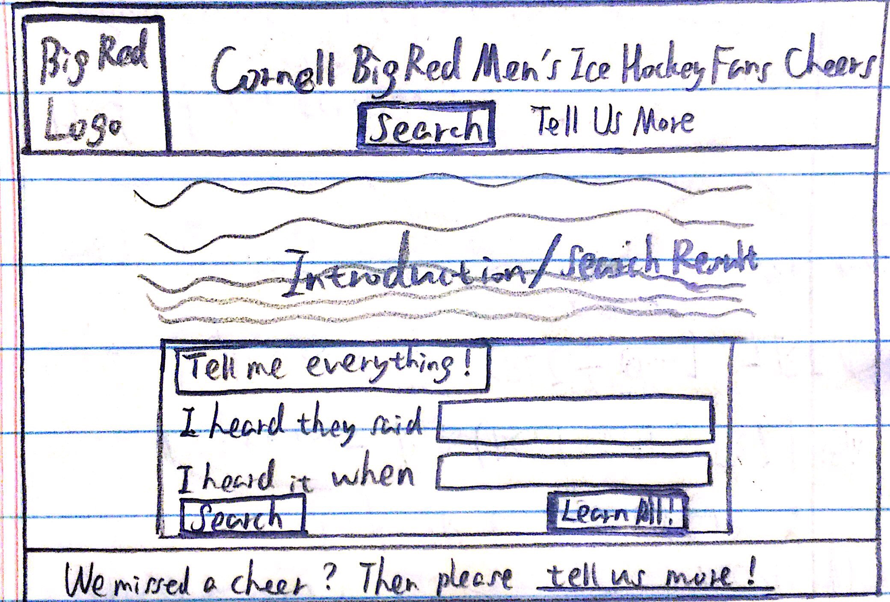
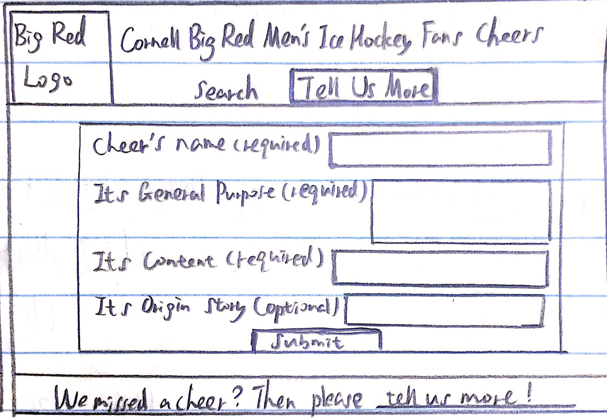
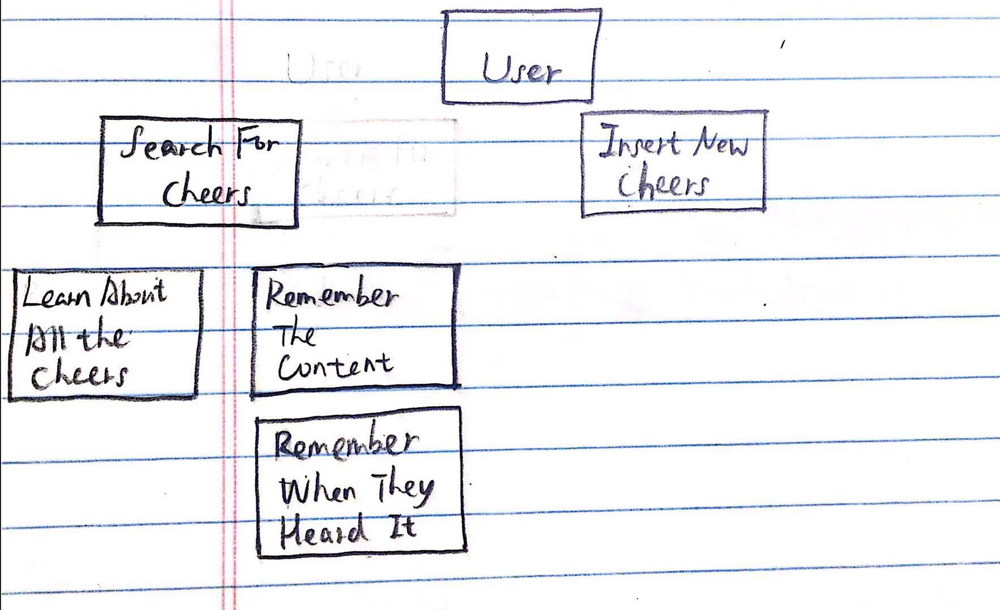
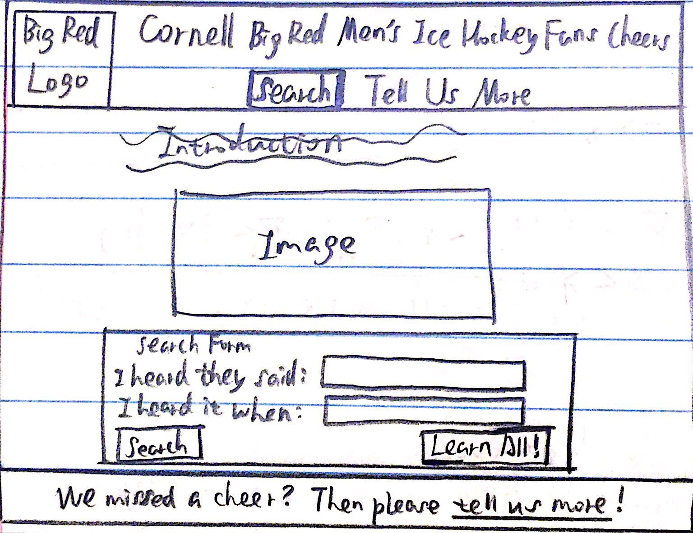

# This is actually my design journey page for project 2 of CS 2300. I'm using it as a test page here.

# Project 2: Design Journey

Your Name: Minghao Li

**All images must be visible in Markdown Preview. No credit will be provided for images in your repository that are not properly linked in Markdown. Assume all file paths are case sensitive!**

# Project 2, Milestone 1 - Design, Plan, & Draft Website

## Describe your Catalog

My collection will be about the cheers the fans of Cornell Big Red men's ice hockey use during the games. The attributes that I will keep track of are id, the name of the cheer, the general purpose of the cheer, the content of the cheer, and the story of its origin(if any).


## Target Audiences

My target audience are the new fans of Cornell Big Red men's hockey who want to learn about the cheers to use during the game, and fans who know the cheers and want to read about the stories behind them.


## Design Process


The image above is my original design of the website. At first I was thinking of making a really simple website with only one page, and designed the search form which allows the users to search for specific cheers by entering words into at least one of the two fields and clicking "Search", or search for all the cheers at once by clicking "Learn All". But then I realized that the page would be crowded if I tried to fit the form used for letting the user insert new entry into this page as well. So I decided to build a website that has two pages.




The two images above are my second design of the search page and the page used for inserting new entries. This design made each page less crowded. But when I was coding up these two pages, I noticed that the search page looked tedious without an image. So, I decided to put an image inside the search page while leaving the design for the page used for inserting new entries unchanged. The final design can be found in the Final Design Plan section.


The image above is my card sorting. I first consider what my target audience - the Cornell men's ice hockey fans - would want to do on my website. Fans may want to search for cheers, and when they search for specific cheers, they may either remember the rough content of the cheers, or just the time at which they heard the cheers. Some fans may don't have a specific cheer in mind, or they have many cheers in mind that they want to learn about. In either case, these fans will like to look at all the cheers at once. When fans don't find the cheer they remember hearing during the game on the website, they may like to add the cheer into the database.


## Final Design Plan


The image above is my final design of the search page. It is very similar to my second design, but it includes the space for an image. The final design of the page used for inserting new entries is the same as the one in the "Design Process" Section.


## Templates

The templates I will use are the header, the footer, and the search form (on the search page only).


## Database Schema Design

Table: movies
* field 1: description..., constraints...
* field...

Table: cheers
* id: the unique id of one cheer record; must be a primary key and an integer, must be unique, not null and can increment automatically.
* name: the name of a cheer; must be a piece of text and not null.
* purpose: the general purpose of a cheer; must be a piece of text and not null.
* content: the content of a cheer; must be a piece of text and not null.
* story: the story behind a cheer; must be either a piece of text or null.

## Database Query Plan

[Plan your database queries. You may use natural language, pseudocode, or SQL.]

1. All records
```sql
SELECT * FROM cheers;
```


2. Search records
```sql
SELECT [fields] FROM cheers WHERE [conditions];
```


3. Insert record

Collect the data from the insert form on the "Tell Us More" page. Write the data into the "cheers" table in "data.splite".


## Code Planning

I will use PHP code for getting the search form and the insert form inputs, and also for making the form sticky. The code that deals with the forms should be of similar structure to the PHP code I used in Project 1.

I will use PHP code to connect to database, and the code will be
```
$db = open_sqlite_db("secure/data.sqlite");
```

The code for making a query will be similar to
```
$sql = "MY_SQL_QUERY;";
$params = array();
$result = exec_sql_query($db, $sql, $params);
```

The code for getting the actual records will be similar to
```
$records = $result->fetchAll();
```

To print out the records, I will define a function that is very similar to the "print_record" function used in lab5.